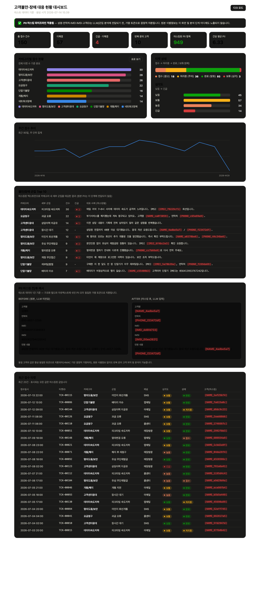

# 고객불만·장애 대응 현황 대시보드 (PII 마스킹 파이프라인 포함)

고객불만/장애 이력을 모아 카테고리·군집별로 정리해 보여주는 대시보드 프로토타입입니다.
LLM(또는 임베딩 기반 군집 분석)으로 넘기기 전에 **성명·연락처·IMEI·IMSI·고객ID** 같은
개인정보를 가명 토큰으로 치환하는 마스킹 단계를 파이프라인 구조로 강제한 것이 핵심입니다.

> ⚠️ 이 저장소의 모든 데이터는 **테스트용 가상 데이터**입니다. 실제 고객 정보는
> 포함되어 있지 않습니다 (`data/generate_test_data.py`로 생성).

## 스크린샷



## 왜 이렇게 만들었나

- **구조적 분리**: 군집/집계 단계(`src/cluster.py`)는 `data/masked_complaints.json`만
  입력으로 받습니다. 원본(`raw_complaints.json`)을 아예 읽지 않기 때문에, 이후 단계가
  실제 LLM 호출로 바뀌어도 "마스킹된 데이터만 LLM에 전달된다"는 원칙이 코드 구조로
  보장됩니다.
- **결정적 가명처리(pseudonymization)**: 같은 고객의 값은 항상 같은 토큰
  (`[NAME_xxxx]`, `[PHONE_xxxx]` 등)으로 치환됩니다(HMAC 기반). 원본 식별정보 없이도
  "반복 문의 고객" 같은 분석이 가능합니다.
- **이중 마스킹**: 구조화 필드(고객명/연락처/IMEI/IMSI/고객ID)뿐 아니라, 민원 본문
  자유텍스트 안에 섞여 들어간 PII(정규식 기반 탐지)까지 함께 마스킹합니다.

## 프로젝트 구조

```
data/
  generate_test_data.py   # 가상 원본 데이터(PII 포함) 생성
  raw_complaints.json      # 생성된 원본 테스트 데이터
  masked_complaints.json   # 마스킹 후 데이터
  masking_audit.json       # 마스킹 처리 건수 감사 로그
  masking_sample.json      # 대시보드에 쓰이는 전/후 샘플
  dashboard_data.json      # 대시보드용 집계 결과
src/
  masking.py               # PII 마스킹 모듈 (핵심)
  cluster.py                # 마스킹된 데이터만 읽어 군집/집계 생성
  build_dashboard.py        # 템플릿에 데이터를 주입해 최종 dashboard.html 생성
templates/
  dashboard_template.html   # 대시보드 UI 템플릿 (데이터 placeholder 포함)
dashboard.html               # 최종 산출물 (브라우저에서 바로 열람 가능)
assets/
  dashboard.png              # 대시보드 스크린샷
```

## 실행 방법

```bash
python3 data/generate_test_data.py   # 1. 테스트 데이터 생성
python3 src/masking.py                # 2. PII 마스킹
python3 src/cluster.py                # 3. 군집/집계 (마스킹된 데이터만 사용)
python3 src/build_dashboard.py        # 4. dashboard.html 빌드
open dashboard.html                   # 5. 브라우저로 확인 (macOS)
```

의존성은 파이썬 표준 라이브러리만 사용합니다 (외부 패키지 설치 불필요).

## 마스킹 대상

| 항목 | 예시 (원본 → 마스킹 후) |
|---|---|
| 고객명 | `김예아` → `[NAME_4adbe5a7]` |
| 연락처 | `010-4657-3286` → `[PHONE_f23472df]` |
| IMEI | 15자리 단말식별번호 → `[IMEI_xxxxxxxx]` |
| IMSI | 15자리 가입자식별번호(`450`로 시작) → `[IMSI_xxxxxxxx]` |
| 고객ID | `CUST-000123` → `[CUSTID_xxxxxxxx]` |
| 자유텍스트 내 PII | 민원 본문에 섞인 위 항목들도 동일 토큰으로 치환 |

## 알려진 한계 / 운영 전환 시 보강 필요 사항

- 이름 탐지는 정규식(존칭 패턴 + 알려진 필드값 매칭) 기반입니다. 실제 서비스에 적용하려면
  한국어 개체명 인식(NER) 기반 탐지로 보강하는 것을 권장합니다. 존칭 없이 등장하는 이름은
  놓칠 수 있습니다.
- `MASK_SALT`는 현재 개발용 기본값입니다. 운영 환경에서는 반드시 비밀관리시스템(예: Vault)에서
  주입해야 합니다.
- 군집화는 외부 ML 의존성 없이 키워드 매칭으로 구현한 경량 버전입니다. 추후 실제 임베딩/LLM
  기반 군집으로 교체하더라도, "마스킹된 텍스트만 입력으로 사용"하는 구조는 그대로 유지하면 됩니다.
